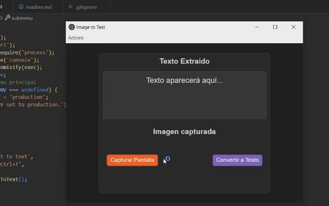

# Image to Text Application

## Descripción

Este proyecto es una aplicación de escritorio construida con Electron. Permite capturar una selección de pantalla y convertir la imagen capturada a texto utilizando Tesseract.js. La aplicación ofrece opciones para copiar el texto al portapapeles, así como guardar imágenes y texto en archivos.

<div align="center">
   
</div>

## Instalación

Para instalar las dependencias y ejecutar la aplicación, sigue estos pasos:

1. **Clona el repositorio:**
   ```bash
   git clone https://github.com/LucasYoris/imageScriptElectron
   ```
2. **Instala las dependencias:**
   ```bash
   npm install
   ```

# Dependencias

## Dependencias de Producción

- **clipboardy:** Permite manipular el portapapeles en la aplicación, facilitando la copia de texto al portapapeles.
- **copy-image-clipboard:** Maneja la funcionalidad para copiar imágenes al portapapeles.
- **electron-reload:** Permite la recarga automática de la aplicación durante el desarrollo, facilitando el proceso de pruebas.
- **img-clipboard:** Facilita la manipulación y extracción de imágenes desde el portapapeles.
- **tesseract.js:** Biblioteca para el reconocimiento óptico de caracteres (OCR) que convierte imágenes en texto.

## Dependencias de Desarrollo

- **cross-env:** Permite establecer variables de entorno en scripts de npm de forma compatible entre diferentes sistemas operativos.
- **electron:** Framework para construir aplicaciones de escritorio con tecnologías web (HTML, CSS y JavaScript).
- **electron-builder:** Herramienta para empaquetar y construir la aplicación para su distribución.
- **electron-packager:** Herramienta para empaquetar la aplicación Electron en diferentes plataformas (Windows, macOS, Linux).

## Uso

Para ejecutar la aplicación en modo desarrollo, usa el siguiente comando:

```bash
npm start
```

Para construir la aplicación para su distribución, utiliza:

```bash
npm run build
```

## Contribuciones

Las contribuciones son bienvenidas. Por favor, abre un issue o envía un pull request para colaborar.

## Licencia

Este proyecto está licenciado bajo la Licencia MIT.
